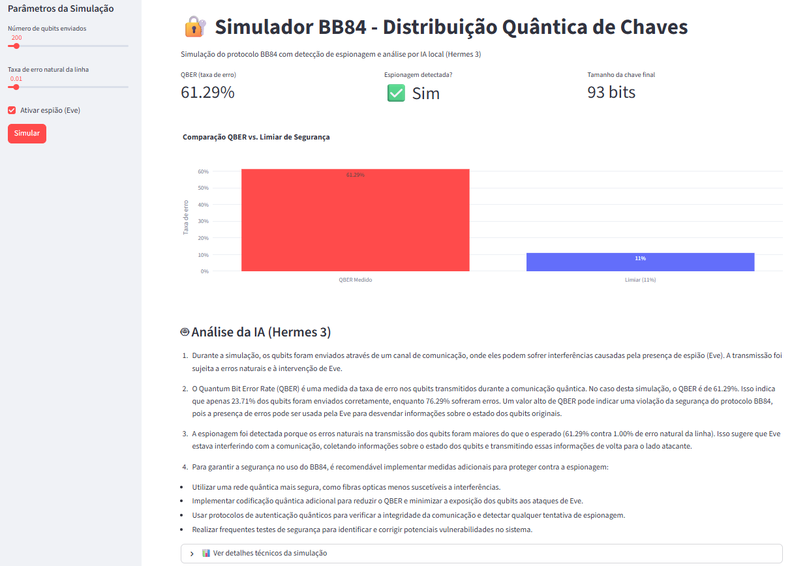

# 🔐 Simulador BB84 – Distribuição Quântica de Chaves com IA Local

Simulador interativo do protocolo BB84 de criptografia quântica, com detecção de espionagem via QBER e geração automática de relatórios explicativos usando IA local (Hermes 3). Desenvolvido com Streamlit, Plotly e integração ao LM Studio.

# 🔗 Referências

**Bennett, C. H., & Brassard, G. (1984). Quantum cryptography: Public key distribution and coin tossing.**

**NIST – Post-Quantum Cryptography**

---

## 🛠️ Stack Principal

| **Linguagem** | **Simulação & Dados** | **IA Local** | **Visualização** |
|---------------|------------------------|--------------|------------------|
|  |  |   |  |
| | | |  |

---

## ✨ Funcionalidades

- 🔐 **Simulação completa do protocolo BB84** – geração de bits e bases por Alice, medição por Bob, sifting e cálculo do QBER.
- 🕵️ **Espionagem configurável** – ative um espião (Eve) que intercepta e reenvia qubits, introduzindo erros detectáveis.
- 📊 **Gráfico interativo** – compara o QBER medido com o limiar de segurança (11%), usando Plotly.
- 🤖 **Análise automática com IA local** – o Hermes 3 (via LM Studio) recebe os parâmetros da simulação e gera um relatório didático em português, explicando o processo, o significado do QBER e as implicações da detecção de espionagem.
- 🧪 **Parâmetros ajustáveis** – número de qubits, taxa de erro natural da linha e ativação do espião.
- 📈 **Visualização técnica** – detalhes completos da simulação disponíveis em um expander.

---

## 🧠 Como funciona o BB84?

O protocolo BB84, proposto por Bennett e Brassard em 1984, permite que duas partes (Alice e Bob) estabeleçam uma chave secreta com segurança garantida pelas leis da mecânica quântica. Qualquer tentativa de espionagem (Eve) inevitavelmente perturba os estados quânticos, elevando a taxa de erro quântico (QBER) acima de um limiar (tipicamente 11%). Este simulador reproduz esse processo numericamente e usa IA local para interpretar os resultados.

---

## 📊 Exemplo de Simulação



*Acima: gráfico comparando o QBER medido com o limiar de segurança, após simulação com espião ativo.*

---

## 🚀 Como Executar

### 1. Pré‑requisitos
- Python 3.9+
- **LM Studio** com o modelo **Hermes 3** carregado e servidor ativo na porta `1234` (opcional para análise com IA)

### 2. Clone o repositório
```bash
git clone https://github.com/Gussnogue/simulador-bb84-distribuicao-quantica-de-chaves.git
cd simulador-bb84-distribuicao-quantica-de-chaves
```

### 3. Crie e ative um ambiente virtual
```bash
python -m venv venv
venv\Scripts\activate   # Windows
source venv/bin/activate   # Linux/Mac
```
### 4. Instale as dependências
```bash
pip install -r requirements.txt
```
### 5. Execute o app
```bash
streamlit run app.py
```

# 📁 Estrutura de Pastas
```bash
simulador-bb84-distribuicao-quantica-de-chaves/
├── .env.example
├── .gitignore
├── requirements.txt
├── README.md
├── app.py                 # Interface Streamlit
├── bb84.py                # Lógica do protocolo BB84
├── ai_analyzer.py         # Comunicação com LM Studio
├── utils.py               # Funções auxiliares
└── simulador-bb84-*.png   # Imagem de exemplo
```
